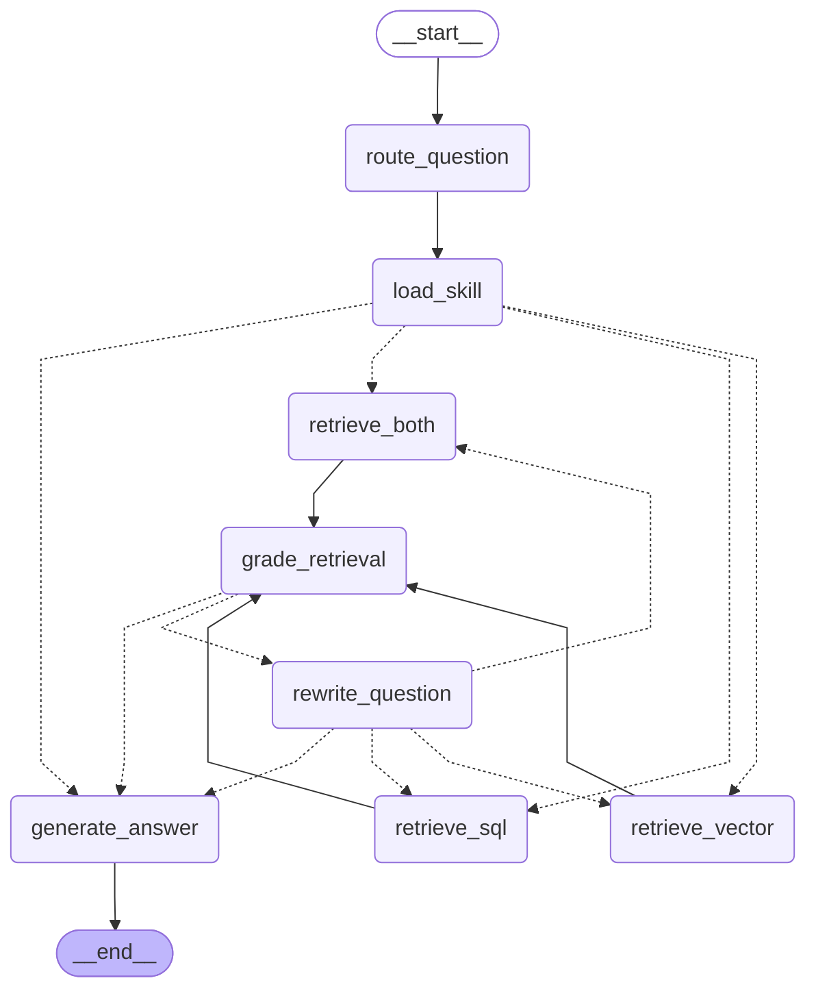

# Personal Finance Agent — Graph Topology

This diagram is auto-generated by `src/agents/finance_agent.visualize_graph()`.
Re-run after any changes to nodes or edges to keep it up to date.

## How to read it
- **Solid arrows** (→) are unconditional edges.
- **Dashed arrows** (⇢) are conditional edges whose target depends on state.
- `grade_retrieval` fans out to either `generate_answer` (score ≥ 0.5 or
  retries ≥ 2) or `rewrite_question` (score < 0.5 and retries < 2).
- `rewrite_question` loops back to the same retrieval node that was used
  originally, controlled by `route_retrieval()`.

## Node responsibilities

| Node | Writes to state |
|------|----------------|
| `route_question` | `selected_skill`, `retrieval_strategy` |
| `load_skill` | `skill_context` |
| `retrieve_vector` | `retrieved_docs` |
| `retrieve_sql` | `sql_results` |
| `retrieve_both` | `retrieved_docs`, `sql_results` |
| `grade_retrieval` | `relevance_score` |
| `rewrite_question` | `rewritten_question`, `retry_count` |
| `generate_answer` | `generation`, `messages` |
